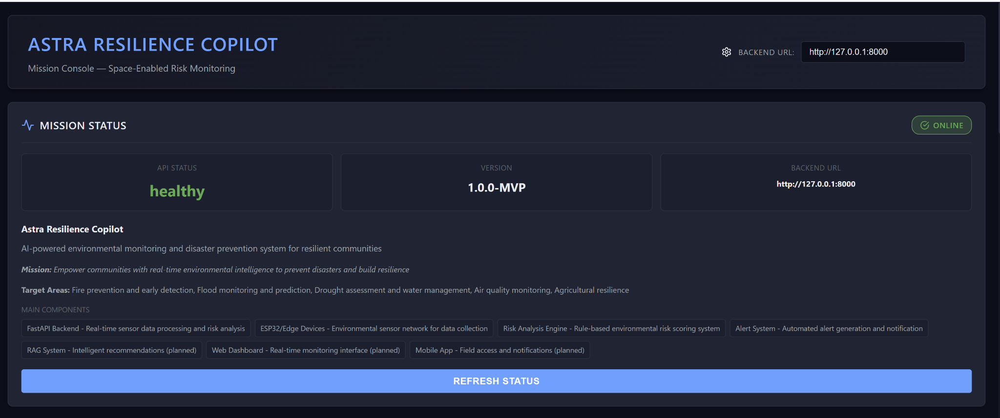
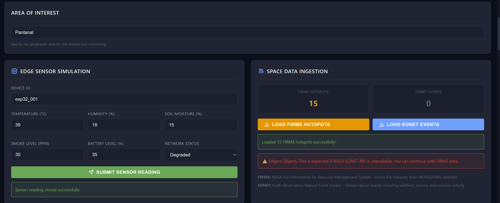
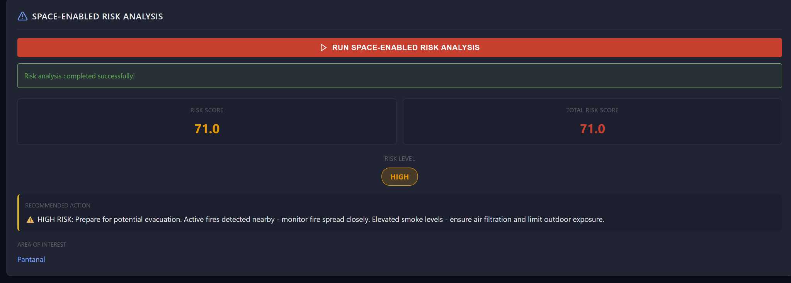
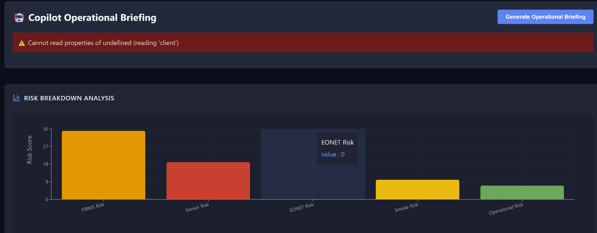
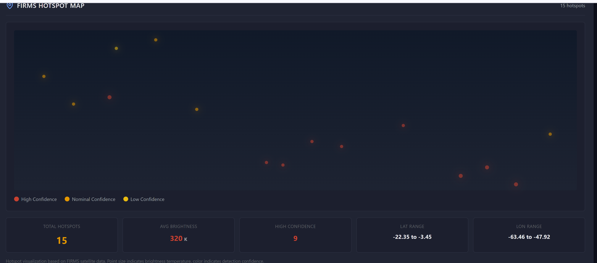
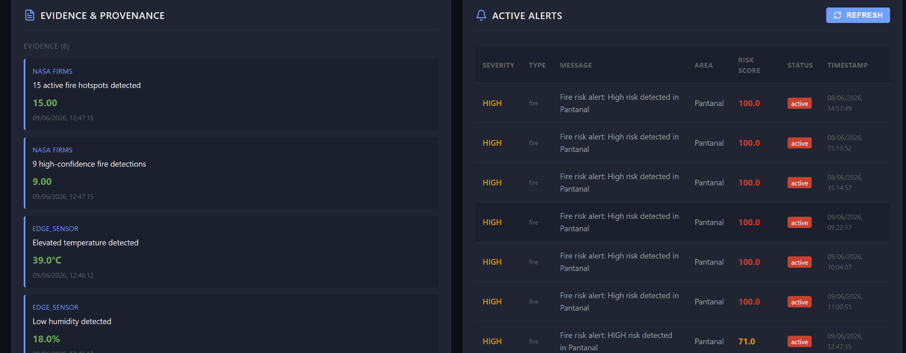

# FIAP - Faculdade de Informática e Administração Paulista

<p align="center">
  <a href="https://www.fiap.com.br/">
    
  </a>
</p>

<br>

# Astra Resilience Copilot

## Nome do grupo

**Astra Resilience Team**

## 👨‍🎓 Integrantes

- **Jonas Luis da Silva** — RM561465
- **Edson Henrique Felix Batista** — RM566321

## 👩‍🏫 Professores

### Tutor(a)

- <a href="https://www.linkedin.com/company/inova-fusca">Lucas Gomes Moreira</a>

### Coordenador(a)

- <a href="https://www.linkedin.com/company/inova-fusca">André Godoi Chiovato</a>

---

## 📜 Descrição

O **Astra Resilience Copilot** é uma Prova de Conceito (POC) desenvolvida para a **Global Solution 2026.1** com foco na nova economia espacial. A solução demonstra como dados orbitais, sensores de borda, automação, análise de dados e IA Generativa podem apoiar decisões rápidas em cenários de risco ambiental.

A plataforma integra dados espaciais derivados de fontes como **NASA FIRMS**, para focos de calor, e **NASA EONET**, para eventos naturais globais, com leituras simuladas de sensores de borda/ESP32. Esses sinais são processados por um motor de risco espacial, que calcula um score ambiental de 0 a 100 usando fatores como hotspots de incêndio, temperatura, umidade, fumaça, conectividade e bateria do dispositivo.

Além da análise numérica, a solução gera **evidências e proveniência dos dados**, permitindo rastrear quais fontes contribuíram para o alerta. Um painel em **React + TypeScript** apresenta uma interface de “mission console”, com status do sistema, ingestão de dados espaciais, simulação de sensor, análise de risco, mapa de hotspots, evidências, alertas e briefing operacional.

O projeto também implementa um **RAG Copilot**, que utiliza uma base local em Markdown para gerar relatórios operacionais baseados em contexto, evidências e recomendações. Assim, o sistema não apenas identifica risco, mas também explica o motivo do alerta e sugere ações práticas para revisão humana.

A POC responde ao desafio central da GS ao mostrar como tecnologias avançadas de IA, automação e computação podem transformar dados espaciais em decisões úteis para prevenção de desastres, resiliência ambiental e monitoramento inteligente.

---

## 🚀 Problema abordado

Eventos ambientais como incêndios, secas, tempestades e enchentes exigem monitoramento rápido, confiável e explicável. Satélites e bases espaciais produzem grandes volumes de dados, mas esses dados precisam ser transformados em alertas, evidências e recomendações operacionais.

O Astra Resilience Copilot propõe uma camada inteligente entre dados espaciais, sensores locais e usuários humanos, funcionando como um copiloto para análise de risco ambiental.

---

## 🧠 Tecnologias utilizadas

### Backend e APIs

- Python 3.11
- FastAPI
- Pydantic
- Uvicorn
- Requests
- Armazenamento JSON local para MVP

### Frontend

- React 18
- TypeScript
- Vite
- Axios
- Recharts
- Lucide React
- CSS customizado

### Dados espaciais e ambientais

- NASA FIRMS, usando amostra local de hotspots para garantir demo offline
- NASA EONET, com chamada opcional à API externa
- Sensor edge/ESP32 simulado

### IA, automação e análise

- Motor de risco espacial baseado em regras explicáveis
- RAG Copilot com base local em Markdown
- Evidência e proveniência dos dados
- Alertas automáticos para risco HIGH/CRITICAL

---

## 🛰️ Funcionalidades implementadas

- Ingestão de hotspots do NASA FIRMS via CSV local.
- Integração opcional com NASA EONET.
- Simulação de sensor edge/ESP32 com temperatura, umidade, fumaça, bateria e conectividade.
- Motor de risco espacial com score de 0 a 100.
- Breakdown do risco por FIRMS, sensor, EONET, fumaça e risco operacional.
- Geração automática de alertas.
- Painel React estilo mission console.
- Mapa visual de hotspots FIRMS.
- Cards de evidência e proveniência.
- RAG Copilot para briefing operacional baseado em conhecimento local.
- Documentação e scripts de execução para Windows PowerShell.

---

## 🧩 Arquitetura da solução

```text
Usuário / Avaliador
        |
        v
React Mission Console (frontend/mission-console)
        |
        v
FastAPI Backend (src/backend)
        |
        +--> NASA FIRMS Local Sample (data/sample/firms_sample.csv)
        +--> NASA EONET API opcional (src/ingestion/eonet_client.py)
        +--> Edge Sensor Simulation (POST /sensor/readings)
        +--> Spatial Risk Engine (src/intelligence/spatial_risk_engine.py)
        +--> RAG Copilot (src/rag/copilot.py + data/knowledge/*.md)
        +--> Alerts and runtime JSON files (data/processed/)
```

---

## 📁 Estrutura de pastas

A organização segue a lógica do template FIAP, que prevê `docs` para documentação e prints, `src` para código-fonte, `data` para bases utilizadas e `README.md` como guia geral do projeto.

```text
.
├── data/
│   ├── knowledge/
│   │   ├── astra_architecture.md
│   │   ├── eonet_notes.md
│   │   ├── firms_notes.md
│   │   ├── operational_guidelines.md
│   │   └── risk_methodology.md
│   ├── processed/
│   │   └── .gitkeep
│   └── sample/
│       └── firms_sample.csv
│
├── docs/
│   ├── architecture/
│   │   └── architecture-diagram.png
│   ├── screenshots/
│   │   ├── 01-mission-status.png
│   │   ├── 02-edge-and-space-data.png
│   │   ├── 03-risk-analysis.png
│   │   ├── 04-risk-breakdown.png
│   │   ├── 05-firms-hotspot-map.png
│   │   └── 06-evidence-alerts.png
│   ├── pdf/
│   │   └── entrega-global-solution.pdf
│   └── video/
│       └── video-link.md
│
├── frontend/
│   └── mission-console/
│       ├── src/
│       │   ├── api/
│       │   ├── components/
│       │   ├── styles/
│       │   └── types/
│       ├── package.json
│       └── vite.config.ts
│
├── src/
│   ├── backend/
│   │   ├── main.py
│   │   ├── models/
│   │   ├── routes/
│   │   └── utils/
│   ├── ingestion/
│   │   ├── eonet_client.py
│   │   └── firms_client.py
│   ├── intelligence/
│   │   └── spatial_risk_engine.py
│   └── rag/
│       └── copilot.py
│
├── .env.example
├── .gitignore
├── README.md
├── TESTING.md
├── requirements.txt
├── run.ps1
├── run_frontend.ps1
├── setup.ps1
├── test_copilot.ps1
└── test_spatial_risk.ps1
```

---

## 🖼️ Prints da aplicação

### Mission Status



### Sensor Edge e ingestão de dados espaciais



### Análise de risco espacial



### Breakdown do risco



### Mapa de hotspots FIRMS



### Evidências, proveniência e alertas



---

## 🔧 Como executar o projeto

### Pré-requisitos

- Python 3.11 recomendado.
- Node.js 18 ou superior.
- npm.
- Windows PowerShell.

> Observação: Python 3.13 pode causar falha de instalação do `pydantic-core` nas versões fixadas em `requirements.txt`. Para esta POC, usar Python 3.11.

### 1. Clonar o repositório

```powershell
git clone <URL_DO_REPOSITORIO>
cd "Global Solutions 2026"
```

### 2. Criar e ativar ambiente virtual Python

```powershell
py -3.11 -m venv venv
.\venv\Scripts\Activate.ps1
python -m pip install --upgrade pip
pip install -r requirements.txt
```

### 3. Executar backend FastAPI

Porta padrão:

```powershell
python -m uvicorn src.backend.main:app --host 127.0.0.1 --port 8000
```

Se a porta 8000 estiver ocupada:

```powershell
python -m uvicorn src.backend.main:app --host 127.0.0.1 --port 8002
```

A API ficará disponível em:

```text
http://127.0.0.1:8000
http://127.0.0.1:8000/docs
```

### 4. Executar frontend React

Em outro terminal:

```powershell
cd frontend/mission-console
npm install
npm run dev
```

O frontend ficará disponível em:

```text
http://localhost:5173
```

Se o backend estiver em outra porta, alterar o campo **Backend URL** na interface React.

---

## ✅ Fluxo de demonstração

1. Iniciar o backend FastAPI.
2. Iniciar o frontend React.
3. Verificar status da missão como online.
4. Enviar leitura do sensor edge com valores de alto risco.
5. Carregar hotspots FIRMS.
6. Opcionalmente carregar EONET.
7. Executar a análise de risco espacial.
8. Visualizar score, nível de risco e breakdown.
9. Visualizar mapa de hotspots.
10. Visualizar evidências e proveniência.
11. Gerar o briefing operacional com o Copilot.
12. Mostrar alertas ativos.

---

## 🧪 Testes manuais principais

### Health check

```powershell
Invoke-RestMethod "http://127.0.0.1:8000/health"
```

### FIRMS

```powershell
Invoke-RestMethod "http://127.0.0.1:8000/events/firms?limit=10"
```

### Sensor edge

```powershell
$body = @{
    device_id = "esp32_001"
    temperature = 39
    humidity = 18
    soil_moisture = 15
    smoke_level = 35
    battery_level = 35
    network_status = "degraded"
} | ConvertTo-Json

Invoke-RestMethod "http://127.0.0.1:8000/sensor/readings" -Method POST -ContentType "application/json" -Body $body
```

### Risk analysis

```powershell
$riskBody = @{
    area_of_interest = "Pantanal"
    sensor_data = @{
        temperature = 39
        humidity = 18
        soil_moisture = 15
        smoke_level = 35
    }
} | ConvertTo-Json -Depth 5

$risk = Invoke-RestMethod "http://127.0.0.1:8000/risk/analyze" -Method POST -ContentType "application/json" -Body $riskBody
$risk
```

### Copilot report

```powershell
$copilotBody = @{
    risk_analysis = $risk
} | ConvertTo-Json -Depth 10

Invoke-RestMethod "http://127.0.0.1:8000/copilot/report" -Method POST -ContentType "application/json" -Body $copilotBody
```

---

## 📎 Links and notes

- **GitHub repository:** [repository link](https://github.com/jonsilva91/Global-Solutions-2026).
- **video:** [Demo Video](https://youtu.be/znjxI3e4TjI).
- **PDF:** `docs/pdf/entrega-global-solution.pdf`.

---

### Decisões técnicas

- O FIRMS usa CSV local para garantir funcionamento da demo mesmo sem chave de API.
- O EONET é opcional e pode falhar caso a API externa esteja indisponível.
- O sensor ESP32 é representado por simulação edge na POC.
- O motor de risco é rule-based para manter explicabilidade.
- O RAG Copilot usa base local em Markdown e fallback determinístico, sem exigir chave paga de LLM.
- O frontend usa React para apresentar a solução com aparência de produto.

---

## 🗃 Histórico de lançamentos

- **1.0.0 - 09/06/2026**
  - MVP funcional com backend FastAPI, React Mission Console, FIRMS, EONET opcional, sensor edge simulado, motor de risco espacial, alertas e RAG Copilot.

- **0.5.0 - 09/06/2026**
  - Integração do frontend React com API e visualização de risco.

- **0.4.0 - 09/06/2026**
  - Implementação do motor de risco espacial com FIRMS, EONET e sensor.

- **0.3.0 - 08/06/2026**
  - Implementação da ingestão NASA FIRMS e EONET.

- **0.2.0 - 08/06/2026**
  - Implementação dos endpoints de sensor, risco e alertas.

- **0.1.0 - 08/06/2026**
  - Estrutura inicial do projeto e backend FastAPI.

---

## 📋 Licença

Este projeto é acadêmico e foi desenvolvido para a FIAP Global Solution 2026.1.

Modelo de README baseado no template FIAP. Recomenda-se manter a licença do template conforme orientação institucional.
